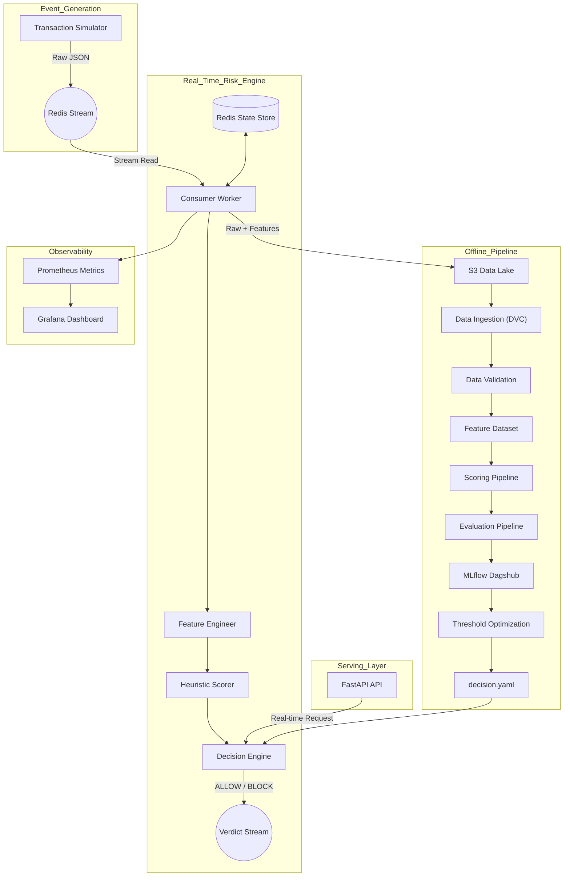

# Real-Time Transaction Risk Engine

A production-style fraud detection system designed to simulate how real fintech risk engines operate — not just how models are trained.

---

## Overview

Most fraud detection projects stop at model training.

This system focuses on **end-to-end decision-making under real-world constraints**:

- Streaming data ingestion  
- Stateful behavioral feature engineering  
- Rule-based risk scoring  
- Cost-aware decision optimization  

---

## Key Capabilities

- **Real-time streaming pipeline** using Redis Streams  

- **Behavioral feature engineering**
  - velocity patterns  
  - geo anomaly detection  
  - device/IP switching  

- **Heuristic risk scoring engine**
  - weighted rules  
  - YAML-driven configuration  

- **Decision engine**
  - threshold-based verdicts (ALLOW / CHALLENGE / BLOCK)  

- **Offline evaluation pipeline**
  - precision / recall  
  - false positive / negative rates  
  - expected fraud loss  
  - review cost  

---

## Architecture


---

# Core Concept — Why This System Exists

> **Fraud detection is not a classification problem.**
> It is a **decision problem under trade-offs.**

Most tutorials train a model, check accuracy, and stop there.
This system starts where they stop.

---

## The Real Problem

Every fraud decision carries a cost — in both directions.

| Decision | Outcome | Cost |
|---|---|---|
| Miss a fraud (False Negative) | Transaction goes through | Financial loss — real money gone |
| Flag a real user (False Positive) | Transaction blocked | Customer friction + operational review cost |

A model optimizing for accuracy alone ignores this entirely.
A production system cannot.

---

## How This System Models It

```python
expected_loss = sum(amount_i for each missed fraud i)   # False Negatives
review_cost   = false_positives * cost_per_review       # False Positives

total_cost = expected_loss + review_cost
```

The engine doesn't just ask *"is this fraud?"*

It asks:

> **"What is the cost of being wrong — in either direction — for this specific transaction?"**

---

## Why This Matters

A `$5` transaction and a `$5,000` transaction are not the same decision problem.

- A false negative on `$5` → acceptable loss  
- A false negative on `$5,000` → significant financial damage  
- A false positive on a high-value loyal customer → churn risk  

Risk scoring must be **amount-aware** and **context-aware** — not just probability-aware.

---

## What This Changes in the Architecture

This trade-off model drives three design decisions in the system:

1. **Weighted scoring** — rules carry different weights based on signal strength and transaction context  
2. **Threshold tiers** — `APPROVE / REVIEW / DECLINE` instead of binary classification  
3. **Explainable decisions** — every score returns reason codes so the cost of each decision can be audited  

---

## The Formula in Plain English

```
If the cost of missing this fraud > cost of reviewing it → flag it  
If the cost of a false positive > the fraud risk → approve it
```

The engine holds both sides of that equation simultaneously.  
That is what separates a decision system from a classifier.

---

# Example Transaction — Enriched Payload

When a transaction enters the pipeline, the raw event is enriched with behavioral features before scoring.  
This is what the engine actually evaluates.

---

## Enriched Transaction Object

```json
{
  "tx_id": "9eac1077-9b57-4f13-b5cd-ccc406bc5672",
  "user_id": "USR_01131",
  "amount_usd": 76.09,
  "country": "ZA",
  "amount_ratio": 0.88,
  "geo_speed": 30.42,
  "is_new_device": 0,
  "risk_score": 0,
  "verdict": "ALLOW"
}
```

---

## Field Reference

| Field | Type | Description |
|---|---|---|
| `tx_id` | `string` | Unique transaction identifier (UUID) |
| `user_id` | `string` | Anonymised user reference |
| `amount_usd` | `float` | Transaction amount in USD |
| `country` | `string` | ISO 3166-1 alpha-2 country code of the transaction origin |
| `amount_ratio` | `float` | Transaction amount relative to the user's historical average spend (1.0 = exactly average) |
| `geo_speed` | `float` | Estimated travel speed (km/h) between this and the previous transaction location |
| `is_new_device` | `int` | Binary flag — `1` if device fingerprint is unseen for this user, `0` if known |
| `risk_score` | `int` | Composite score output by the heuristic engine (0–100) |
| `verdict` | `string` | Final decision — `ALLOW`, `REVIEW`, or `DECLINE` |

---

## Reading This Transaction

```
amount_ratio: 0.88  → spending slightly below their average  → low signal
geo_speed:   30.42  → plausible travel speed                 → low signal
is_new_device:   0  → known device                           → low signal
risk_score:      0  → no rules triggered
verdict:     ALLOW  → transaction approved
```

This is a **clean transaction** — no behavioral anomalies detected.
The engine found nothing worth flagging.

---

## What a High-Risk Transaction Looks Like (Contrast)

```json
{
  "tx_id":        "f3c90a12-...",
  "user_id":      "USR_00874",
  "amount_usd":   1842.00,
  "country":      "NG",
  "amount_ratio": 4.30,
  "geo_speed":    892.10,
  "is_new_device": 1,
  "risk_score":   87,
  "verdict":      "DECLINE"
}
```

```
amount_ratio: 4.30   → spending 4.3x their average           → high signal
geo_speed:  892.10   → impossible travel (faster than a plane)→ critical signal  
is_new_device:   1   → unknown device                        → elevated signal
risk_score:     87   → multiple rules triggered, weighted sum
verdict:   DECLINE   → transaction blocked
```

The same pipeline. Two very different decisions.
That is the scoring engine working as designed.

---
# Project Structure
---

Directory structure:
└── muhammedshibili688-transaction-risk-engine/
    ├── README.Docker.md
    ├── README.md
    ├── app.py
    ├── compose.yaml
    ├── consumer.py
    ├── datas.dvc
    ├── Dockerfile
    ├── dvc.lock
    ├── dvc.yaml
    ├── evaluation_runner.py
    ├── LICENSE
    ├── models.dvc
    ├── prometheus.yaml
    ├── requirements.txt
    ├── scoring_runner.py
    ├── setup.py
    ├── simulator.py
    ├── template.py
    ├── .dockerignore
    ├── .dvcignore
    ├── config/
    │   ├── decision.yaml
    │   ├── rules.yaml
    │   ├── schema.yaml
    │   └── rules/
    │       └── baseline.yaml
    ├── src/
    │   ├── __init__.py
    │   ├── components/
    │   │   ├── data/
    │   │   │   ├── __init__.py
    │   │   │   ├── data_ingestion.py
    │   │   │   ├── data_transformation.py
    │   │   │   └── data_validation.py
    │   │   └── model/
    │   │       ├── __init__.py
    │   │       ├── decision_engine.py
    │   │       ├── model_evaluation.py
    │   │       ├── model_trainer.py
    │   │       └── scorer.py
    │   ├── configuration/
    │   │   ├── __init__.py
    │   │   ├── aws_connection.py
    │   │   └── redis_connection.py
    │   ├── constants/
    │   │   └── __init__.py
    │   ├── entity/
    │   │   ├── artifact_entity.py
    │   │   └── config_entity.py
    │   ├── exception/
    │   │   └── __init__.py
    │   ├── logger/
    │   │   └── __init__.py
    │   ├── pipeline/
    │   │   ├── evaluation_pipeline.py
    │   │   ├── experiment_pipeline.py
    │   │   ├── prediction_pipeline.py
    │   │   ├── scoring_pipeline.py
    │   │   └── training_pipeline.py
    │   └── utils/
    │       ├── __init__.py
    │       └── main_utils.py
    └── .dvc/
        └── config


# MLflow Experiment Tracking

Every scoring run is tracked as an MLflow experiment — making results reproducible, comparable, and auditable across rule versions.

---

## What Gets Logged

### Metrics

| Metric | What It Measures |
|---|---|
| `precision` | Of all flagged transactions, how many were actual fraud |
| `recall` | Of all actual frauds, how many did the engine catch |
| `false_positive_rate` | Rate of legitimate transactions incorrectly blocked |
| `false_negative_rate` | Rate of frauds that slipped through |
| `expected_loss_usd` | Total dollar value of missed frauds (false negatives) |
| `review_cost_usd` | Operational cost of manually reviewing flagged transactions |

### Parameters

| Parameter | Description |
|---|---|
| `rule_version` | Version tag of the active rule configuration |
| `thresholds` | Score cutoffs for ALLOW / REVIEW / DECLINE decisions |
| `weights` | Per-rule contribution weights used in the scoring engine |

> Logging both cost metrics (`expected_loss_usd` and `review_cost_usd`) alongside standard
> classification metrics reflects the core design philosophy — optimizing for **total cost**,
> not just accuracy.

---

## Current Build Status

```
Core Pipeline
─────────────────────────────────────────────────
 ✅  Redis Streams pipeline
 ✅  Transaction simulator with fraud state machine
 ✅  Behavioral feature engineering
 ✅  Rule-based scoring engine
 ✅  Cost-based evaluation + MLflow tracking
 ✅  DVC pipeline integration

In Progress
─────────────────────────────────────────────────
 🔄  Threshold optimization (cost-minimization driven)

Planned
─────────────────────────────────────────────────
 ⬜  ML model integration (hybrid scoring layer)
 ⬜  Monitoring — Prometheus + Grafana
 ⬜  Load testing and latency benchmarking
```

---

## Why This Project

Most fraud detection tutorials stop at model training.

This project starts where they stop:

- **Data pipelines** — streaming, enrichment, feature engineering at ingestion time
- **Decision systems** — not classification, but cost-aware scoring with explainable verdicts
- **Production trade-offs** — explicitly modelling the tension between fraud prevention and customer experience

The goal was never a high-accuracy notebook.
The goal was a system that could survive a production environment.

---

## Future Work

```
1. Threshold optimization pipeline
   → Grid search over ALLOW/REVIEW/DECLINE cutoffs
   → Objective: minimize total_cost = expected_loss + review_cost

2. Hybrid scoring layer
   → Rule-based score + ML model probability → weighted ensemble

3. Real-time monitoring & alerting
   → Prometheus metrics exposed via FastAPI
   → Grafana dashboards for score distribution, verdict rates, drift

4. Load testing & benchmarking
   → Measure p50 / p95 / p99 latency under simulated TPS load
   → Identify pipeline bottlenecks before scaling
```

---

## Results

After tuning thresholds:

- Recall improved: 0.20 → 0.61  
- Expected Loss reduced: $18M → $6.3M  
- False Positive Rate increased slightly: 0.03 → 0.07  

Trade-off chosen to minimize total cost.

## Tech Stack

| Layer | Technology |
|---|---|
| Language | Python |
| Streaming | Redis Streams |
| Pipeline versioning | DVC |
| Experiment tracking | MLflow + DagsHub |
| API serving | FastAPI |
| Monitoring | Prometheus + Grafana *(planned)* |
