# Real-Time Transaction Risk Engine

<p align="center">
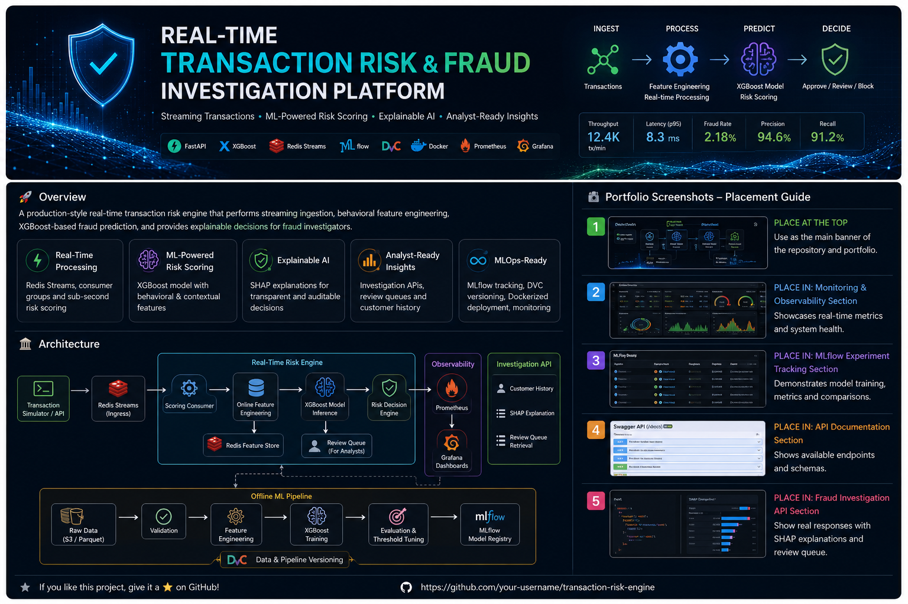
</p>

> **End-to-end machine learning platform for streaming fraud detection, explainable AI, real-time monitoring, and analyst investigation APIs.**

<p align="center">


</p>

---

## Overview

Financial institutions process millions of transactions every day. Detecting fraudulent behavior requires more than a machine learning model—it requires a complete real-time decision platform capable of ingesting streaming transactions, generating behavioral features, performing low-latency inference, monitoring predictions, and providing explainable decisions for fraud analysts.

This project demonstrates how an end-to-end machine learning system can be built for real-time fraud detection, combining streaming inference, online feature engineering, explainable AI, model monitoring, and investigation APIs.

## Core Capabilities

- Real-time transaction processing
- Online behavioral feature engineering
- XGBoost-based fraud prediction
- SHAP explainability
- Redis Streams event processing
- Investigation APIs
- Monitoring with Prometheus & Grafana
- Experiment tracking using MLflow
- Dataset versioning using DVC
- Containerized deployment using Docker Compose

The system is designed to resemble the architecture used in production fraud detection platforms, combining streaming inference, model monitoring, experiment tracking, and explainable AI into a unified workflow.

---

## Dataset

The project uses a synthetic financial transaction dataset generated to simulate legitimate user behavior alongside multiple fraud scenarios, including card testing, behavioral mimicry, device reuse, and anomalous transaction patterns. The dataset is used for both offline model training and real-time streaming simulation.

---

Traditional fraud detection often focuses only on model accuracy. This project demonstrates how a machine learning model can be integrated into a production-style streaming architecture with online feature engineering, explainable predictions, monitoring, experiment tracking, and investigation APIs.

---

## Production Performance

| **Metric** | **Value** |
|---------|--------:|
| Average Scoring Latency | 5.38 ms |
| Maximum Latency | 337 ms |
| Precision | 0.902 |
| Recall | 0.854 |
| False Positive Rate | 2.04% |
| Fraud Rate | 17.5% |


These metrics were collected from the production-style monitoring dashboard during live transaction simulation.

## System Architecture

<p align="center">
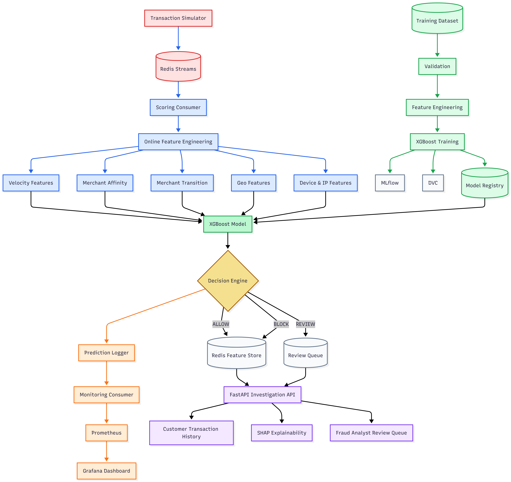
</p>

### Project Highlights

- Streaming transaction ingestion using Redis Streams
- Online behavioral feature engineering
- Real-time XGBoost fraud scoring
- SHAP-based model explainability
- Investigation APIs for fraud analysts
- Redis-backed analyst review queue
- MLflow experiment tracking
- Prometheus & Grafana observability
- DVC pipeline and dataset versioning
- Fully containerized with Docker Compose


The architecture separates online inference, offline model development, monitoring, and investigation workflows into loosely coupled components, enabling scalable deployment and independent service evolution.

---

## Key Features

### Real-Time Processing

- Redis Streams transaction ingestion
- Consumer groups
- Online feature computation
- Low-latency inference
- Review queue generation

---

### Machine Learning

- XGBoost fraud classifier
- Behavioral feature engineering
- Threshold optimization
- Feature importance
- SHAP explainability

---

## Fraud Investigation API

The FastAPI service exposes investigation endpoints for fraud analysts. The API enables fraud analysts to investigate customer activity, inspect model decisions, and review suspicious transactions in real time.

### Swagger Documentation

<p align="center">
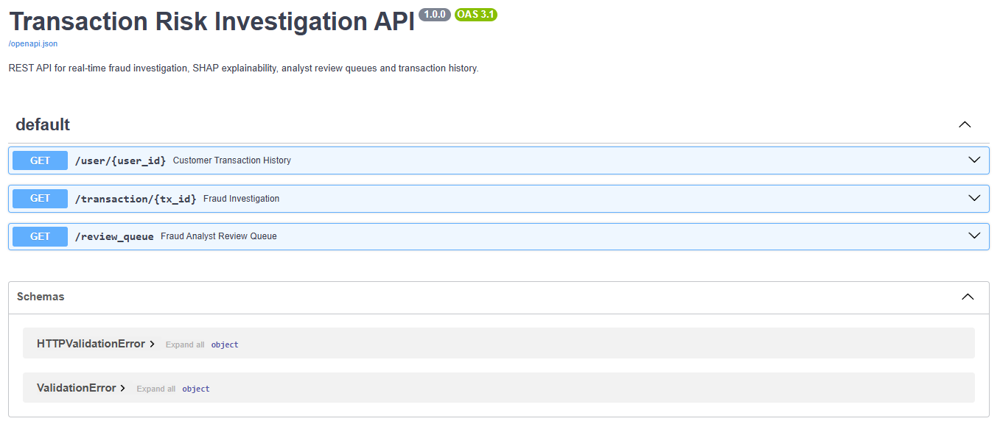
</p>

---

### GET /user/{user_id}

Customer transaction history endpoint.

<p align="center">
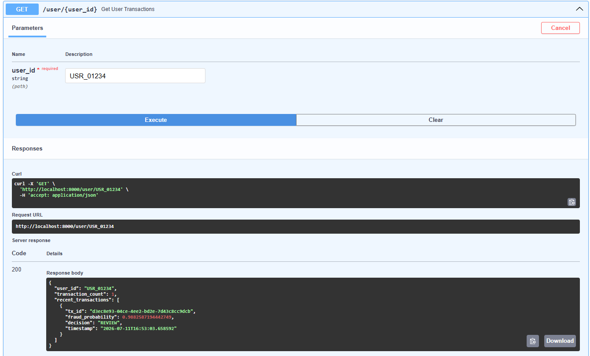
</p>

---

### GET /transaction/{tx_id}

Transaction investigation with SHAP explainability.

<p align="center">
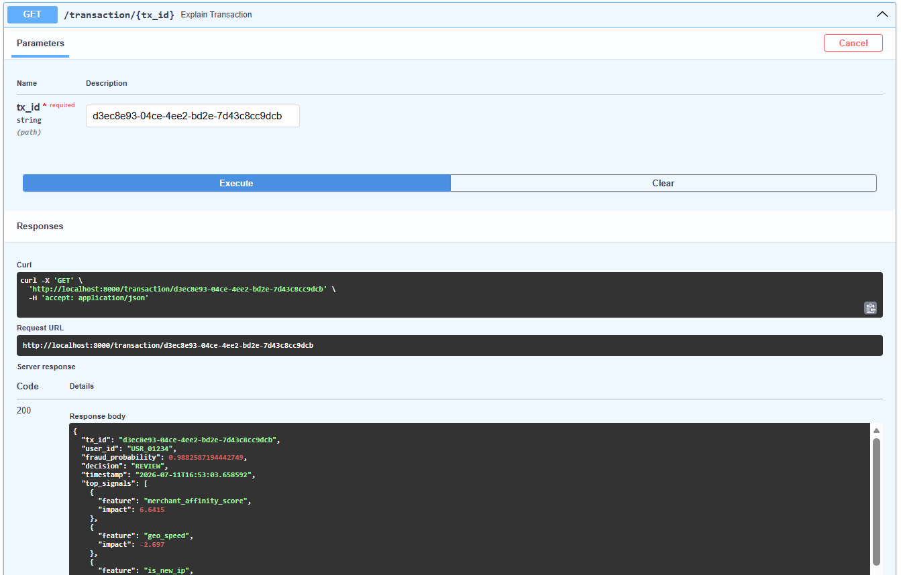
</p>

---

### GET /review_queue

Pending fraud analyst review queue.

<p align="center">
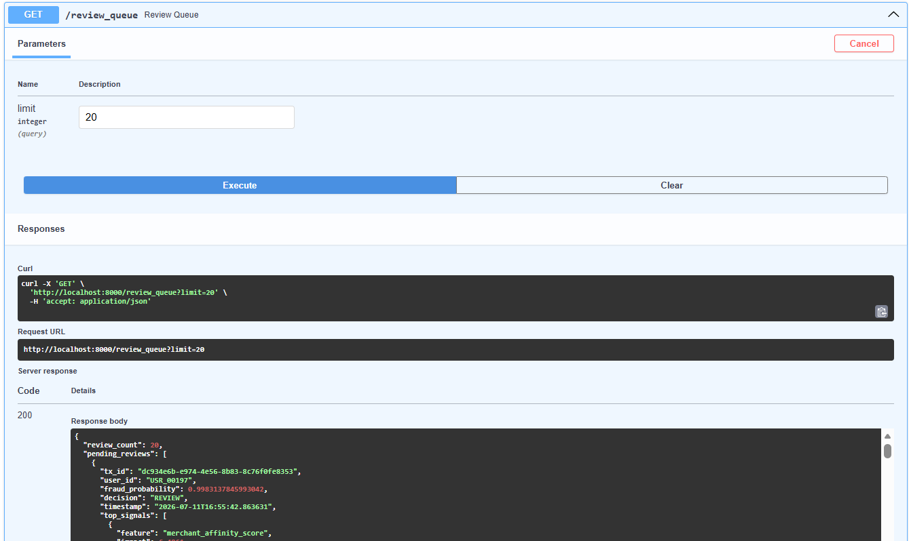
</p>

---

### SHAP Explainability

Each fraud prediction includes SHAP-based feature contributions, allowing analysts to understand which behavioral signals influenced the model's decision.

Example SHAP explanation returned by the Investigation API:

```json
{
  "decision": "REVIEW",
  "fraud_probability": 0.988,
  "top_signals": [
    {
      "feature": "merchant_affinity_score",
      "impact": 6.64
    }
  ]
}
```

---

## Monitoring & Observability

The platform continuously tracks production metrics including:

- Average Scoring Latency
- Maximum Latency
- Precision
- Recall
- Fraud Rate
- Review Rate
- False Positive Rate
- Merchant Affinity
- Merchant Transition Score
- Prediction Throughput

The following dashboards illustrate system behavior during startup and steady-state operation.

### Cold Start

<p align="center">
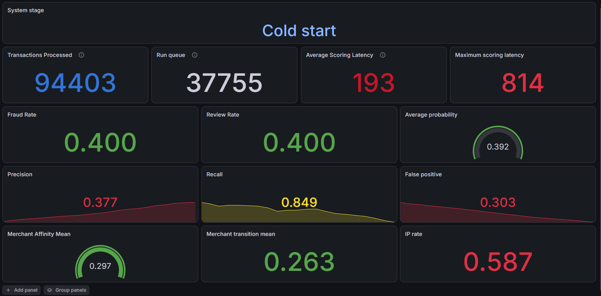
</p>

### Stable State

<p align="center">
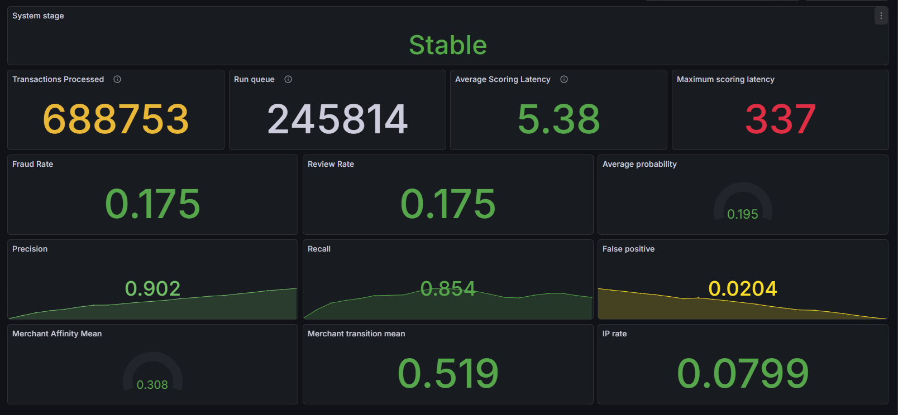
</p>

The dashboards continuously monitor inference latency, prediction quality, fraud rate, review rate, and feature behavior, helping detect operational issues and model degradation.

---

## Model Training & Experiment Tracking

MLflow provides complete experiment lifecycle management, including:

- Experiment tracking
- Hyperparameter logging
- Performance comparison
- Model versioning
- Artifact storage

Every training run logs hyperparameters, evaluation metrics, feature configuration, and model artifacts, enabling reproducible experimentation and model comparison.

### Experiment Comparison

<p align="center">
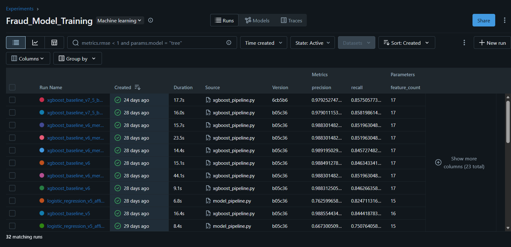
</p>

### Best Performing Model

<p align="center">
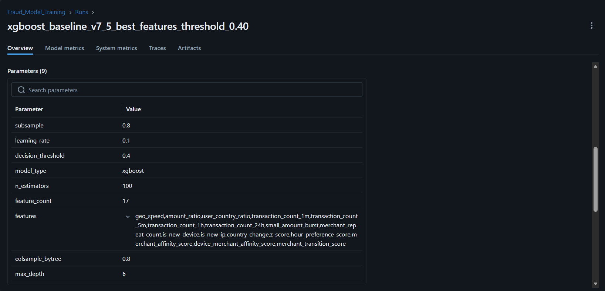
</p>

---

## Data Versioning

Datasets and pipelines are versioned using DVC.

Pipeline stages include:

- Ingestion
- Validation
- Feature Engineering
- Model Training
- Evaluation

---

## Technology Stack

| Layer | Technology |
|-------|-----------|
| 💻 Programming | Python |
| 🌊 Streaming | Redis Streams |
| 🤖 Machine Learning | XGBoost, Scikit-learn |
| 🔍 Explainability | SHAP |
| 🚀 API | FastAPI |
| 📊 Monitoring | Prometheus, Grafana |
| 📈 Experiment Tracking | MLflow |
| 📦 Data Versioning | DVC |
| 🐳 Containerization | Docker Compose |
| 📚 Data Processing | Pandas, NumPy |

---

## Project Structure

```text
transaction-risk-engine/

├── src/
│   ├── api/
│   ├── serving/
│   ├── monitoring/
│   ├── feedback/
│   ├── components/
│   ├── pipelines/
│   ├── entity/
│   └── configuration/
│
├── datas/
├── models/
├── notebooks/
├── artifacts/
├── images/
├── compose.yaml
├── Dockerfile
├── requirements.txt
└── README.md
```

---

## Containerized Deployment

The entire platform runs using Docker Compose.

Docker Compose orchestrates the platform's microservices, enabling local deployment with a single command.

- Transaction Simulator
- Scoring Consumer
- Monitoring Consumer
- Feedback Consumer
- Investigation API
- Prometheus
- Grafana
- Redis

<p align="center">
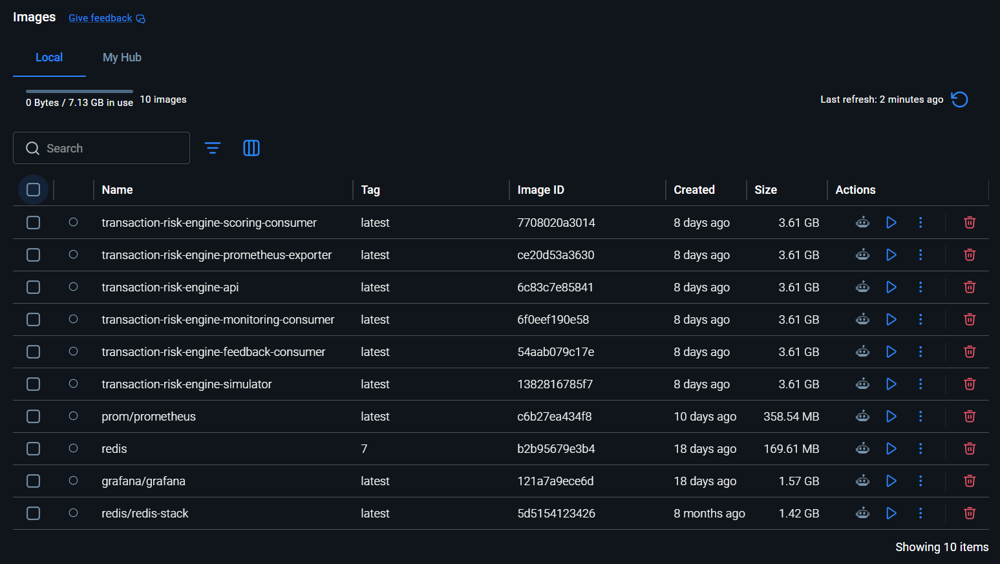
</p>

```bash
docker compose up --build
```

Each service runs inside an isolated Docker container and communicates through the Docker Compose network.

---

## API Documentation

### Swagger UI

```
http://localhost:8000/docs
```

Interactive OpenAPI documentation is automatically generated by FastAPI.

---

## Monitoring Dashboard

### Grafana

```
http://localhost:3000
```

### Prometheus

```
http://localhost:9090
```

The monitoring stack provides real-time operational visibility into latency, throughput, fraud rate, review rate, and model performance.

---

## Performance

The current implementation provides:

- Online behavioral feature generation
- Low-latency XGBoost inference
- Explainable predictions using SHAP
- Asynchronous monitoring
- Redis-backed streaming pipeline
- Production-style containerized deployment

---

## Future Enhancements

- Kubernetes deployment
- CI/CD pipeline
- MLflow Model Registry
- Canary deployments
- Online retraining
- Kafka integration
- Cloud deployment (AWS)

---

## Author

**Muhammed Shibili**

Machine Learning Engineer | MLOps | Real-Time AI Systems

GitHub: <https://github.com/Muhammedshibili688>

LinkedIn: <https://www.linkedin.com/in/muhammedshibili001/>